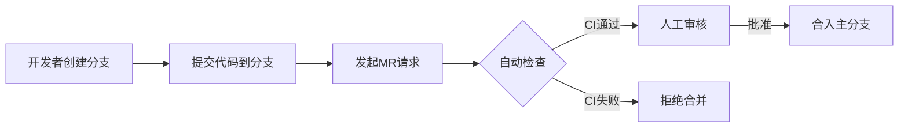

# 简介
此项目是为了提供开发人员快速理解和使用gitlab而准备分为以下几个部分。
## 零、git工具基础介绍
[详见GitBasicIntroduction.md](./docs/GitBasicIntroduction.md)

## 一、gitlab简介
[详见Introduction.md](./docs/Introduction.md)
## 二、权限控制篇
目标：明确不同角色在代码合入中的权限边界<br>
内容：PermissionControl.md
```
GitLab 角色与权限对照表
    开发者 vs 维护者 vs 管理员的具体权限（表格对比）
保护分支（Protected Branches）配置
    如何设置 main/production 分支的推送/合并权限
    通配符保护（如 release/*）
项目/组级别权限继承规则
    如何通过群组（Group）批量管理权限
```
[详见PermissionControl.md](./docs/PermissionControl.md)<br>
## 三、代码合入流程篇
目标：规范代码从提交到合入的完整流程<br>
内容：
```
合并请求（Merge Request, MR）强制化
    如何关闭直接推送（仅允许通过 MR 合入）
MR 审核规则
    必须至少 X 个审核人批准（企业版功能）
    必须关联 Issue（Closes #123）
状态检查（Status Checks）
    要求 CI/CD 流水线成功才能合并
    强制代码扫描通过（SonarQube 集成）
```

[详见CodeMergingProcess.md](./docs/CodeMergingProcess.md)<br>
## 四、议题管理规范（Issue 使用）
目标：通过议题管理项目规范、类比华为的SR需求单和DTS问题单<br>
内容：
```

Issue 类型划分（Bug、Feature、Task）
模板介绍
如何关联 MR（Fixes #123 语法）
状态流转建议（待处理 → 开发中 → 待测试 → 关闭）
```
[详见IssueManagementSpecification.md](./docs/IssueManagementSpecification.md)<br>
## 五、里程碑使用说明
目标：用于版本、Sprint 管理<br>
内容：
```
命名建议（如 Sprint-2024-W22、v1.0-release）
关联 Issue 和 MR 的方式
用作进度追踪和规划
```

[详见InstructionsForUsingMilestones.md](./docs/InstructionsForUsingMilestones.md)<br>

## 六、标签体系规范
目标：便于分类过滤任务<br>
内容：
```
标签分类建议：
    类型：bug, feature, refactor
    状态：in-review, blocked, ready-for-test
    优先级：P0, P1, P2
命名风格保持统一
在创建 Issue/MR 时的使用指引    
```

*待完善*
## 七、CI/CD 简介

```
什么是 .gitlab-ci.yml
常见 CI 阶段：
    build
    test
    lint
    deploy（如部署到测试环境）
使用 Runner 的基本介绍（注册、配置）
示例 CI 文件模板
```

*待完善*

## 八、代码评审质量保障规范
```
是否必须 Review？
谁能审核哪些人代码（按角色或模块）
审核 Checklist（如是否有测试、是否符合命名规范）
```

*待完善*