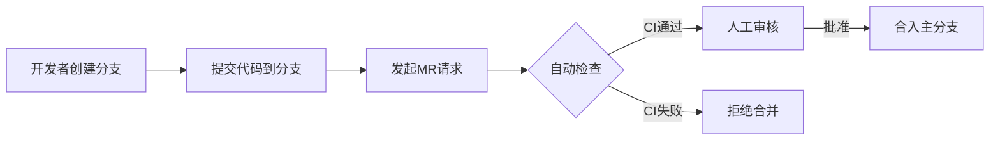

# 简介
此项目是为了提供开发人员快速理解和使用gitlab而准备分为以下几个部分。

## 一、gitlab简介
[详见Introduction.md](./docs/Introduction.md)
## 二、权限控制篇
目标：明确不同角色在代码合入中的权限边界<br>
内容：PermissionControl.md
```
GitLab 角色与权限对照表
    开发者 vs 维护者 vs 管理员的具体权限（表格对比）
保护分支（Protected Branches）配置
    如何设置 main/production 分支的推送/合并权限
    通配符保护（如 release/*）
项目/组级别权限继承规则
    如何通过群组（Group）批量管理权限
```
[详见PermissionControl.md](./docs/PermissionControl.md)<br>
## 三、代码合入流程篇
目标：规范代码从提交到合入的完整流程<br>
内容：
```
合并请求（Merge Request, MR）强制化
    如何关闭直接推送（仅允许通过 MR 合入）
MR 审核规则
    必须至少 X 个审核人批准（企业版功能）
    必须关联 Issue（Closes #123）
状态检查（Status Checks）
    要求 CI/CD 流水线成功才能合并
    强制代码扫描通过（SonarQube 集成）
```

## 四、代码检查与质量门禁篇
目标：通过自动化工具拦截低质量代码<br>
内容：
```
GitLab CI/CD 集成检查工具
静态代码分析（SAST）：ESLint、RuboCop
依赖漏洞扫描（Dependency Scanning）
代码覆盖率阈值（如 <80% 则失败）
自定义规则示例
```
## 五、紧急情况处理篇
目标：提供权限管控的例外流程<br>
内容：
```
临时解除分支保护（管理员操作指南）
Hotfix 流程
如何创建紧急修复分支（hotfix/ 前缀）
事后补 MR 和审计记录
```
## 六、最佳实践与常见问题
目标：减少团队误操作<br>
内容：
```
错误案例
误推送主分支后的回滚方法
MR 冲突解决指南
权限矩阵模板（Excel/表格）
如何监控不合规操作（Audit Events）
```