# 代码合入流程规范
## 零、Git SSH 配置步骤

1. 生成 SSH 密钥对（如果还没有）

在服务器或本地终端执行：
```sh
ssh-keygen -t rsa -b 4096 -C "your_email@example.com"
```
2. 查看并复制公钥内容
```sh
cat ~/.ssh/id_rsa.pub
```
复制输出的全部内容。

3. 添加公钥到 GitLab
    1. 登录你的 GitLab 网页端。
    2. 右上角点击头像 → Preferences（偏好设置）→ SSH Keys。
    3. 粘贴刚才复制的公钥内容到“Key”文本框，设置名称和有效期，点击“Add key”。
4. 测试 SSH 连接
```sh
ssh -T git@your.gitlab.server
```
5. 用 SSH 地址 clone 仓库
```sh
git clone git@your.gitlab.server:yourgroup/yourrepo.git
```
## 一、总体流程
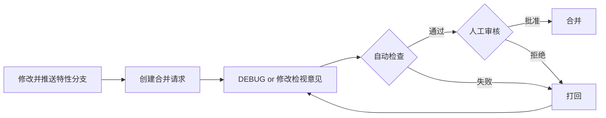
## 二、修改并推送特性分支
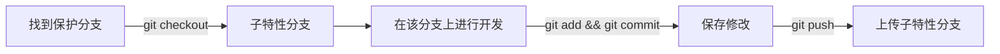
下面会演示具体流程：<br>
1、先找到保护分支:（开发之前就要明确告知开发人员）<br>
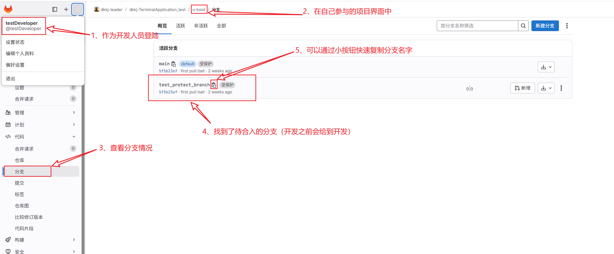<br>
2、通过`git`界面创建子分支<br>
```sh
git checkout test_protect_branch
git checkout -b test_developer_personal_branch
```
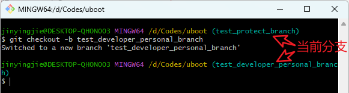<br>
3、之后通过`git push`上传分支，如果远端没有此分支，第一次上传需要：
```
git push --set-upstream origin test_developer_personal_branch
```
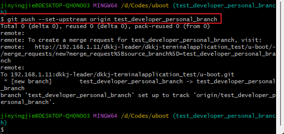<br>

4、做具体的业务代码修改，此处为开发人员的核心工作<br>
5、通过如下命令在自己分支上确认修改并上传
```
git add .
git commit -m "test"
git push
```
此处可以通过git log确认自己的commit生效<br>
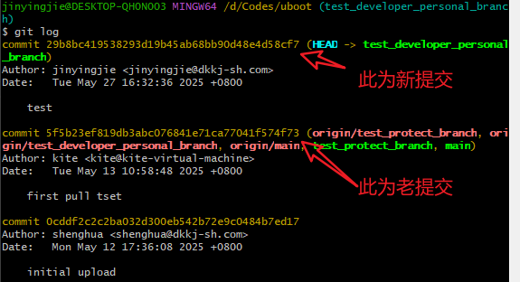<br>

## 三、创建合并请求
此处直接在界面上演示<br>
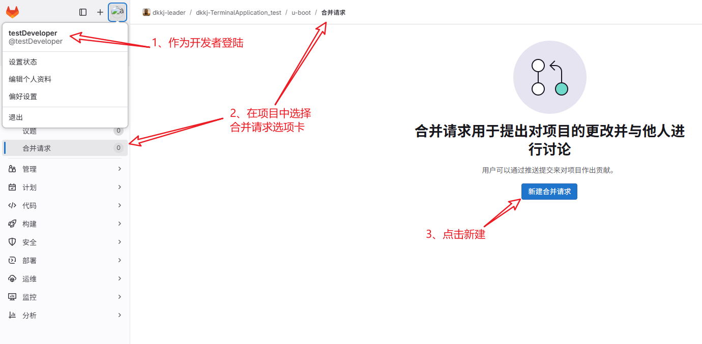<br>
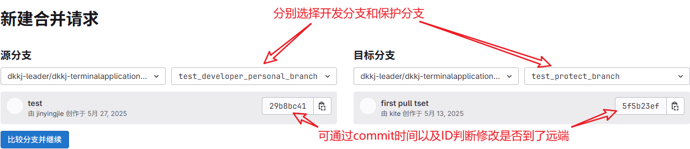<br>
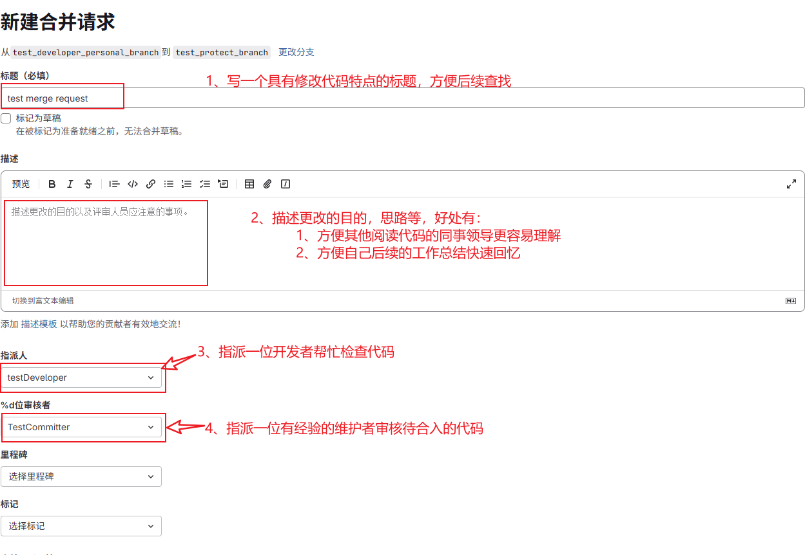<br>

## 四、人工审核并合并
此处直接在界面上演示<br>
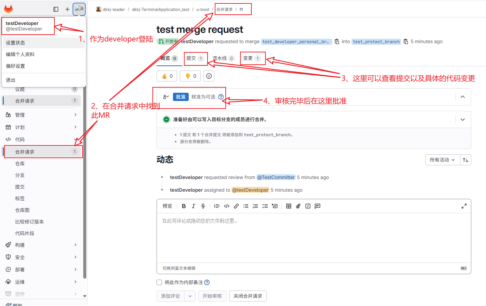<br>
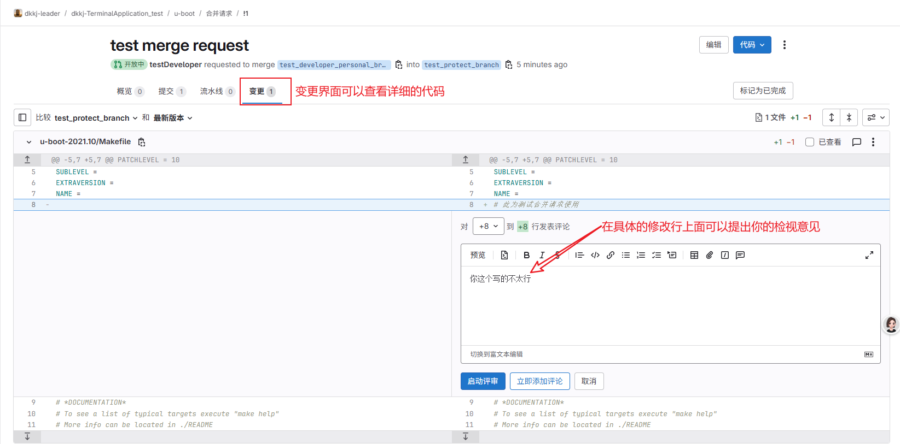<br>
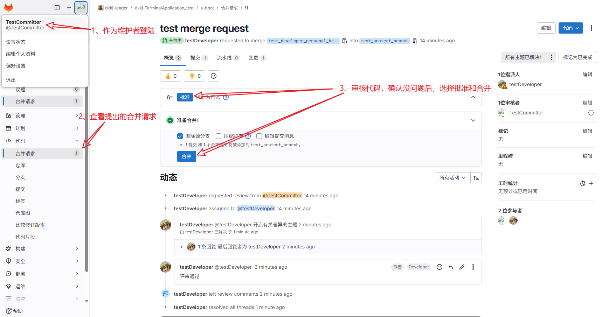<br>
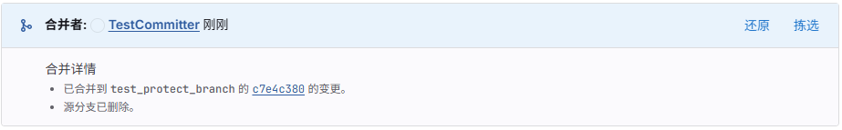<br>
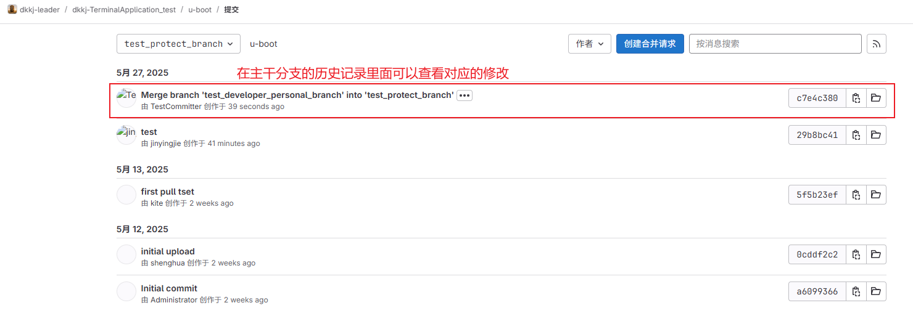<br>
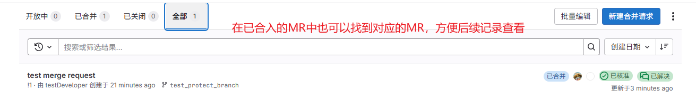<br>