## 小剧场
```
有一个男孩，曾深深爱过一个人，却在关键时刻没能鼓起勇气说出口。

后来，他觉醒了超能力——他能通过照片穿越回过去，去重新看清那些走岔的瞬间。

他回到了那个夜晚，那个他本该表白却沉默的节点，这一次，他鼓起了勇气，说出了心里话。于是，历史被改写，现实的主线也随之刷新。

随着能力增强，他可以在无数平行宇宙中试错，在每一个世界里用不同的方式去求婚。他一次次失败，一次次重来，最终找到了一种最笃定、最真诚的方式，把它带回现实，成功地赢得了她的心。

后来他们有了孩子，这是爱情最真实的“发布版本”。但某一天，危机降临，他才意识到婚姻早已千疮百孔。

不能回到孩子出生前，他无法从头来过。于是他只能穿越回那些争吵、冷战、误解的时间节点，一次次看清问题、理解自己，用悔意和行动为现在的她打上补丁，修复裂痕。

生命的最后，他静静回望过往：无数的照片、片段、时间戳，记录着他如何一次次试错、一次次努力，为了爱，也为了他自己的人生，拼尽全力。

这不仅是一段爱情故事，更像我们每个人的一生——不断记录、反思、试错、改进，直到生命终章。
```
- **Git就像给文件操作加了CTRL+Z的超级权限**
- **GitLab是我们团队的数字工作记忆中枢**
- **你不需要记住所有命令，只需要知道它能解决什么问题**

## 1. Git三大超能力？
- 时间机器（版本控制）
    - 举例：论文修改时，可以随时回到三天前的版本
    - 演示：git log 显示历史记录（像翻阅日记）
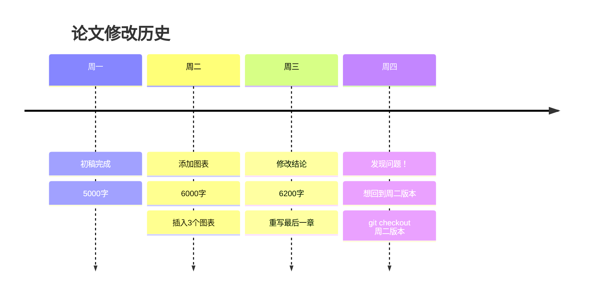

- 平行宇宙（分支管理）
    - 举例：写年度报告时，同时尝试两种排版方案
    - 画图：主分支 vs 实验分支（用树干和树枝比喻）

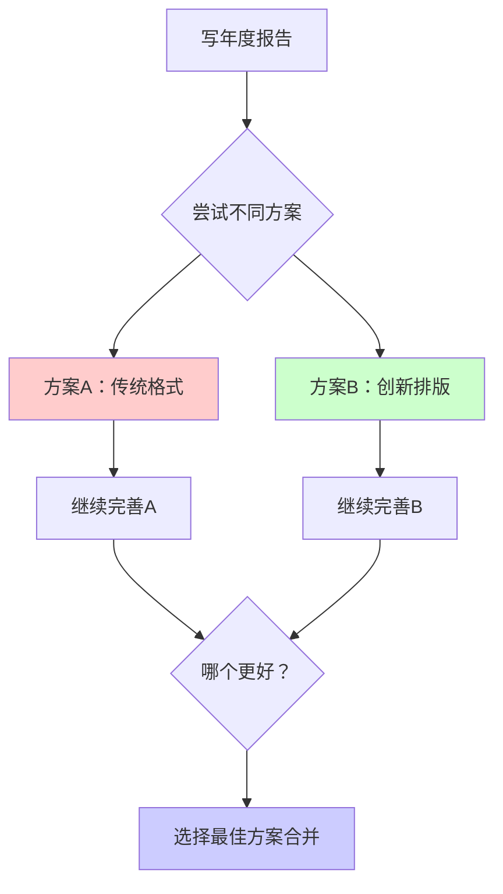

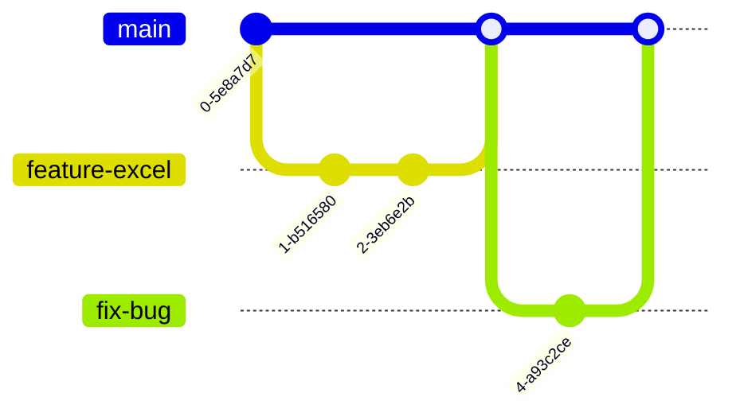
- 安全网（变更追踪）
    - 举例：Excel公式修改出错时，能快速定位问题修改点
    - 演示：git diff 显示文件差异（类似Word修订模式）


## 2. 常用Git命令简介
记住这几个命令就够日常使用了，其他复杂操作可以查文档
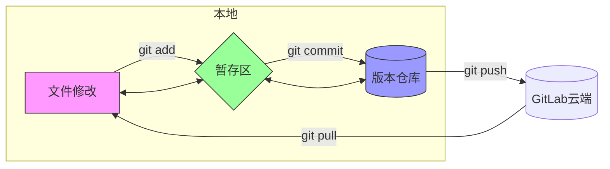

| 类别 | 命令 | 作用 | 示例 |
| ---- | ---- | ---- | ---- |
| **基础操作** | git clone | 克隆远程仓库到本地 | git clone https://xxx.git |
| | git status | 查看当前状态 | git status |
| | git add | 添加文件到暂存区 | git add 文件名 |
| | git commit | 提交更改到本地仓库 | git commit -m "说明" |
| **同步操作** | git pull | 拉取远程最新代码 | git pull |
| | git push | 推送本地代码到远程 | git push |
| **分支操作** | git branch | 查看/创建分支 | git branch, git branch 新分支名 |
| | git checkout | 切换分支 | git checkout 分支名 |
| | git merge | 合并分支 | git merge 分支名 |
| **查看历史** | git log | 查看提交历史 | git log --oneline |
| | git diff | 查看文件差异 | git diff |

更多详细用法请参考[廖雪峰Git教程](https://www.liaoxuefeng.com/wiki/896043488029600)。


## 3. Git实用场景
- **场景1：重要文件管理**
- 现场演示任务：
    1. 创建一个Excel文件（销售数据.xlsx）
    2. 执行 git init 初始化仓库
    3. 添加初始数据并提交：git add . + git commit -m "初始销售数据"
    4. 修改数据，再次提交：git commit -m "更新Q2数据"
    5. 故意删除重要数据
    6. 使用 git log 查看历史
    7. 用 git checkout 恢复到之前版本


- **场景2：团队协作**
- 现场演示任务：

  1. git clone 克隆项目
  2. 修改文件内容
  3. git push 上传更改
  4. 模拟其他人修改
  5. git pull 获取最新版本

流程图：
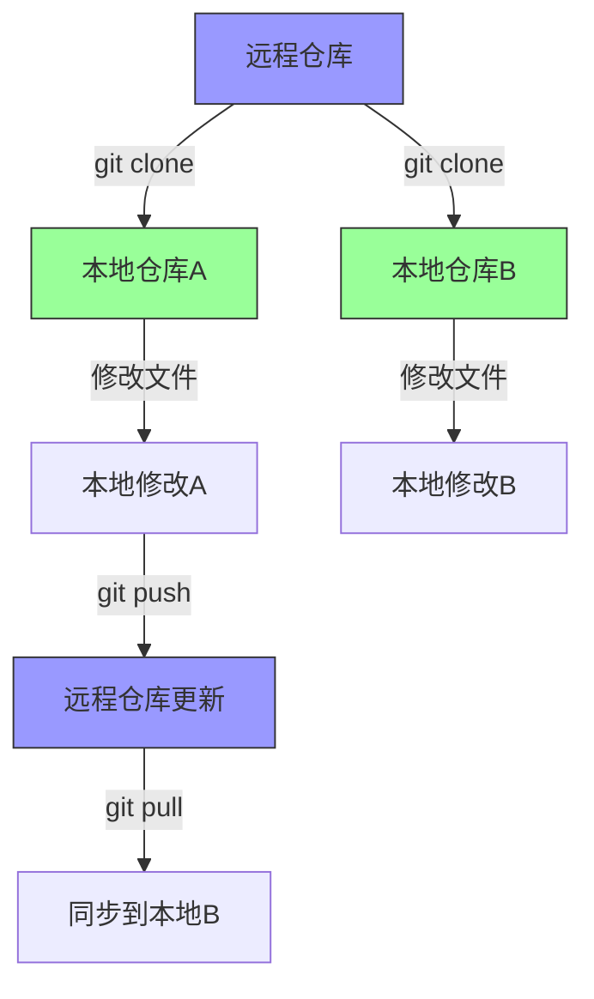

- **场景3：应急恢复**

- 现场演示任务：

  1. git branch experiment 创建实验分支
  2. 在实验分支修改文件
  3. git checkout main 切换回主分支
  4. 对比两个版本差异
  5. git merge 合并成功的实验

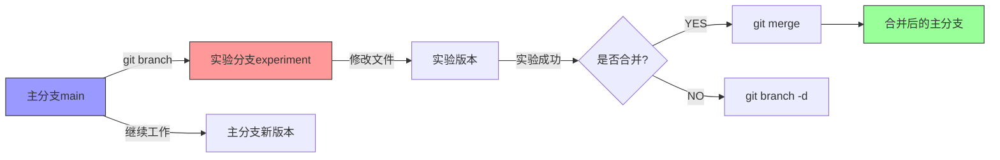
## 4、Git实现原理
刚才我们看到了Git的神奇功能，那它是怎么做到的呢？

核心机制揭秘
1. 内容寻址存储（像图书馆索书号）

- 每个文件内容都有唯一的"身份证"（SHA-1哈希值）
- 文件内容相同 = 身份证相同 = 只存一份
- 演示：刚才我们修改CSV文件，Git就生成了新的哈希值

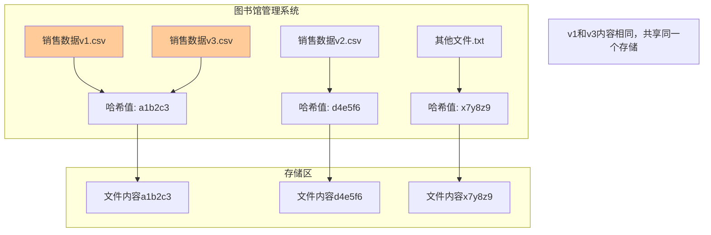
2. 快照式存储（拍立得相片）

- 每次commit = 给整个项目拍一张"全家福"
- 但聪明之处：未修改的文件直接"引用"之前的照片
- 这就是为什么Git能快速回到任意版本
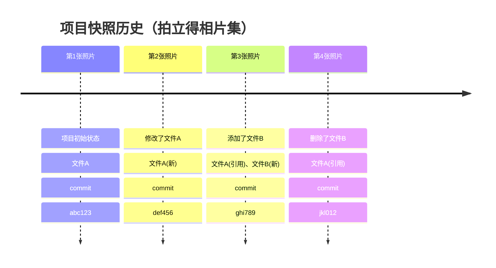
3. 指针网络（时光机导航图）

- HEAD指针：告诉你"现在在哪里"
- 分支指针：不同的"实验路线"
- 标签指针：重要的"里程碑"

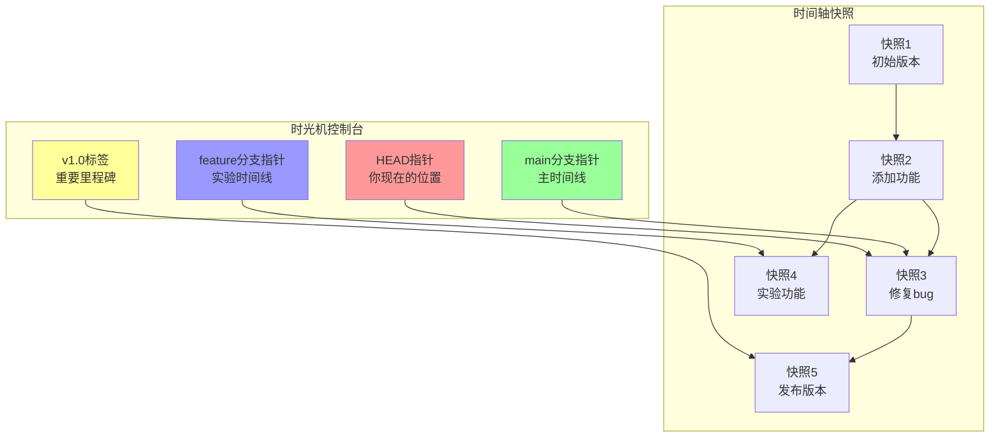
## Git存储本质：索引 + 哈希表
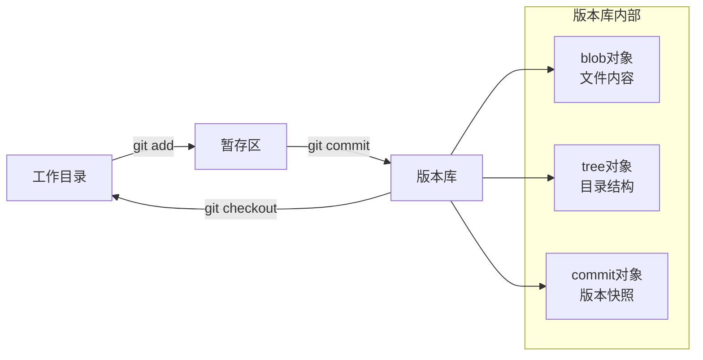


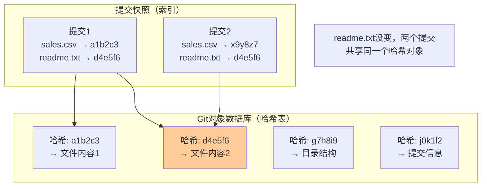
简单理解：

- Git就像一个超级智能的"文件管理员"
- 它记住每个文件的每个版本，但不重复存储
- 通过"指针"快速找到任意时刻的完整项目状态
- 这就是为什么Git既节省空间，又能瞬间切换版本！