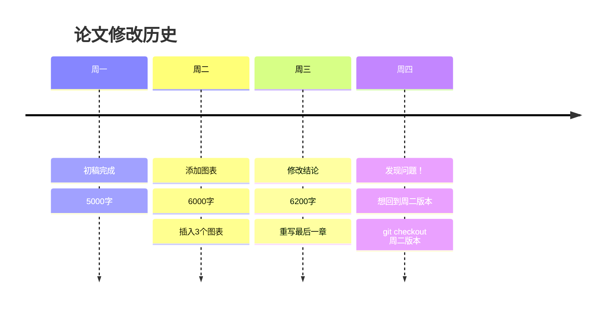
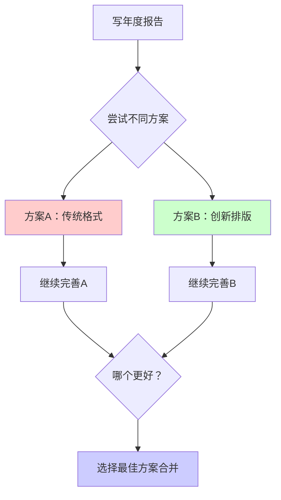
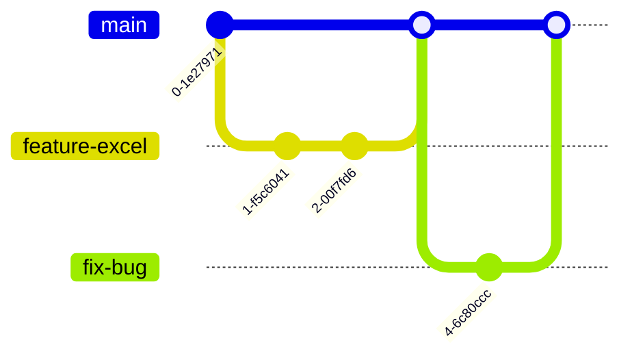
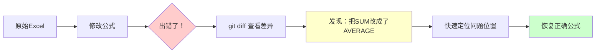
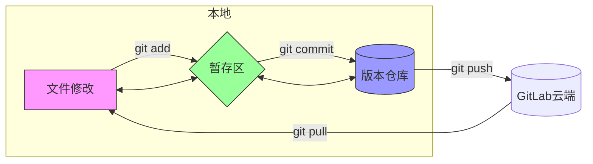
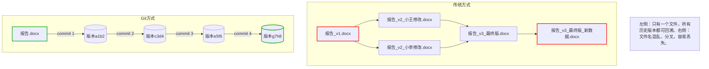
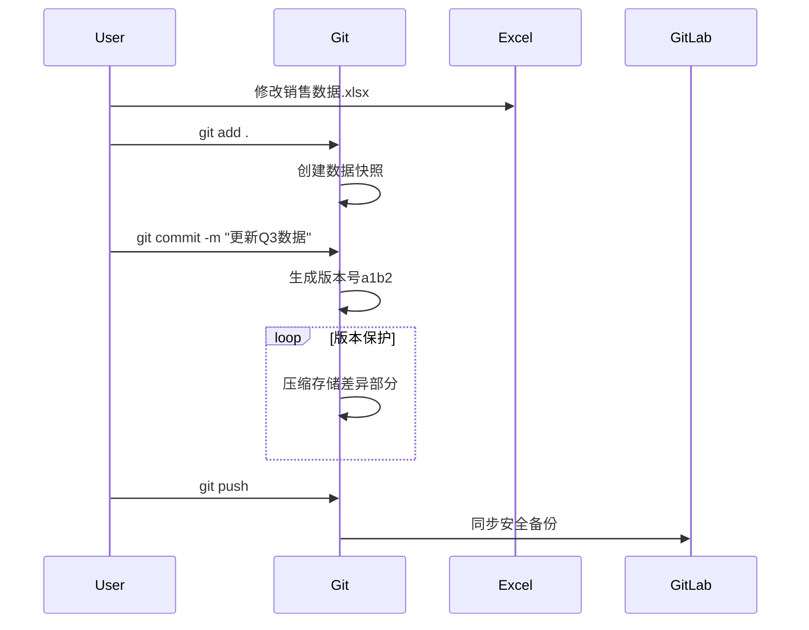

## 开场故事
```
有一个男孩，曾深深爱过一个人，却在关键时刻没能鼓起勇气说出口。

后来，他觉醒了超能力——他能通过照片穿越回过去，去重新看清那些走岔的瞬间。

他回到了那个夜晚，那个他本该表白却沉默的节点，这一次，他鼓起了勇气，说出了心里话。于是，历史被改写，现实的主线也随之刷新。

随着能力增强，他可以在无数平行宇宙中试错，在每一个世界里用不同的方式去求婚。他一次次失败，一次次重来，最终找到了一种最笃定、最真诚的方式，把它带回现实，成功地赢得了她的心。

后来他们有了孩子，这是爱情最真实的“发布版本”。但某一天，危机降临，他才意识到婚姻早已千疮百孔。

不能回到孩子出生前，他无法从头来过。于是他只能穿越回那些争吵、冷战、误解的时间节点，一次次看清问题、理解自己，用悔意和行动为现在的她打上补丁，修复裂痕。

生命的最后，他静静回望过往：无数的照片、片段、时间戳，记录着他如何一次次试错、一次次努力，为了爱，也为了他自己的人生，拼尽全力。

这不仅是一段爱情故事，更像我们每个人的一生——不断记录、反思、试错、改进，直到生命终章。
```
- **Git就像给文件操作加了CTRL+Z的超级权限**
- **GitLab是我们团队的数字工作记忆中枢**
- **你不需要记住所有命令，只需要知道它能解决什么问题**

## 1. Git三大超能力？
- 时间机器（版本控制）
    - 举例：论文修改时，可以随时回到三天前的版本
    - 演示：git log 显示历史记录（像翻阅日记）


- 平行宇宙（分支管理）
    - 举例：写年度报告时，同时尝试两种排版方案
    - 画图：主分支 vs 实验分支（用树干和树枝比喻）




- 安全网（变更追踪）
    - 举例：Excel公式修改出错时，能快速定位问题修改点
    - 演示：git diff 显示文件差异（类似Word修订模式）


## 2. 常用Git命令简介
记住这几个命令就够日常使用了，其他复杂操作可以查文档


| 类别 | 命令 | 作用 | 示例 |
| ---- | ---- | ---- | ---- |
| **基础操作** | git clone | 克隆远程仓库到本地 | git clone https://xxx.git |
| | git status | 查看当前状态 | git status |
| | git add | 添加文件到暂存区 | git add 文件名 |
| | git commit | 提交更改到本地仓库 | git commit -m "说明" |
| **同步操作** | git pull | 拉取远程最新代码 | git pull |
| | git push | 推送本地代码到远程 | git push |
| **分支操作** | git branch | 查看/创建分支 | git branch, git branch 新分支名 |
| | git checkout | 切换分支 | git checkout 分支名 |
| | git merge | 合并分支 | git merge 分支名 |
| **查看历史** | git log | 查看提交历史 | git log --oneline |
| | git diff | 查看文件差异 | git diff |

更多详细用法请参考[廖雪峰Git教程](https://www.liaoxuefeng.com/wiki/896043488029600)。


## 3. Git实用场景
- 场景1：重要文件管理
- 现场演示任务：

    1. 创建一个Excel文件（销售数据.xlsx）
    2. 执行 git init 初始化仓库
    3. 添加初始数据并提交：git add . + git commit -m "初始销售数据"
    4. 修改数据，再次提交：git commit -m "更新Q2数据"
    5. 故意删除重要数据
    6. 使用 git log 查看历史
    7. 用 git checkout 恢复到之前版本


- 场景2：团队协作
    - 上传：git push（把本地修改同步到GitLab）
    - 下载：git pull（获取他人最新版本）
- 场景3：应急恢复
    - git reset --hard 版本号（回到某个历史节点）

用修改Excel文件为例，现场演示：

  - 创建包含销售数据的Excel

  - 做几次修改并commit

  - 故意删错数据后恢复




## 4、Git实现原理

核心机制三要素：

1. 内容寻址存储（像图书馆索书号）

    - 每个文件内容生成唯一SHA-1哈希值（如a1b2c3...）

    - 演示：修改文件后哈希值变化

2. 快照式存储（拍立得相片）

    - 每次commit保存整个项目的瞬间状态

    - 但实际存储时复用未修改文件（节省空间）

3. 指针网络（时光机导航图）

    - HEAD指针：你现在在哪里

    - 分支指针：不同实验路线

    - 标签指针：重要里程碑

- 关键技术比喻：

    - blob对象：文件内容的压缩包（像zip）

    - tree对象：目录结构的描述文件（像图书目录）

    - commit对象：带有时间戳的版本快照（像照片元数据）

```txt
[工作目录] --(git add)--> [暂存区] --(git commit)--> [版本库]
                    ▲                    |
                    └─────(检出操作)──────┘
```


## 5、 推荐学习资料
- 廖雪峰Git教程
- Git官方文档
- 团队内部经验分享

## 6、时光恋人：一段时空中的 Git 爱情故事

第一幕：觉醒能力，查看过去
“男孩发现自己拥有通过照片回到过去的能力——就像 Git 的 git log 和 git checkout。”

📸 git init：男孩开始写日记，记录下他对爱情的探索。

🔍 git log：每一张照片，每一个瞬间，都是他走过的时间节点。

🎞️ git checkout <commit>：他可以回到任何一个旧时刻去看看自己哪里做错了。

第二幕：改写命运，创建分支
“男孩穿越到了表白失败的那个晚上，这次他鼓起勇气说出了心里话。”

🌿 git branch：创建一个新的可能性宇宙。

🛤️ git checkout -b confession-night：他开始在另一个时间线上尝试新的方式。

✅ git merge：他成功了，将这个成功的平行宇宙合并到了主时间线。

第三幕：不断试错，寻找完美表白
“为了求婚，他不断地在平行宇宙中实验不同的方式。”

🔁 git rebase：他用更优雅的方式合并自己的改变。

🧪 git cherry-pick：挑选某些成功的说法，从其他宇宙复制回来。

第四幕：爱情结晶，产品发布
“他们有了孩子，就像一个产品的最终发布。”

📦 git tag v1.0：这是人生的第一个版本发布，孩子的出生。

📤 git push origin master：把自己的幸福成果共享给世界。

第五幕：婚姻危机，不能穿越的限制
“孩子已出生，他不能穿越到孩子出生前，那些历史被锁定了。”

🔒 历史提交不可更改：Git 记录的历史是安全的。

🩹 git revert：他用行动忏悔过去的错误，像打补丁一样修复自己的行为。

第六幕：人生终章，欣慰回顾
“临终时，他翻看着自己的人生提交记录，那些 commit message，既有失误，也有修复。”

🧾 git log --oneline：一行行记录，他为爱情做出的努力。

🕯️ git blame：不是指责，而是责任，是自己为每一段历史负责。

🏁 生命周期终结：一个仓库最终归档，就像软件生命周期走向终点。

