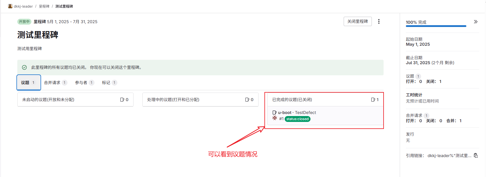
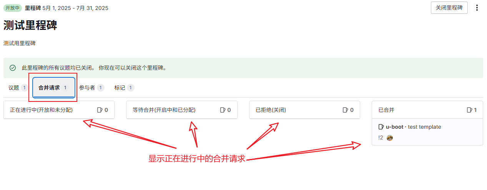

# 第5章 里程碑使用说明（Milestone）

---

## 5.1 什么是里程碑？

里程碑（Milestone）是 GitLab 中用来管理一组议题（Issue）和合并请求（MR）的阶段性目标，通常代表一个开发周期、产品版本或迭代阶段。

它相当于一个“时间盒子”，用于聚合某个周期内所有需要完成的工作。

我们将 GitLab 的 Milestone 作为研发阶段“过点”的管理载体，通过规划关键里程碑（如 PR、PDR、SIT、上线准备等），实现对版本进度和质量的过程管控，借鉴 IPD 的阶段审核思想，并结合工具化看板视图实现研发闭环。

---

## 5.2 使用场景和意义

典型使用场景包括：

- 产品发布版本（如 `v1.0`, `v2.1-beta`）
- 敏捷迭代周期（如 `Sprint-2024-W21`）
- 阶段目标（如 `上线前清单`, `重构阶段`）

通过使用 Milestone，可以：

- 统一目标，明确截止时间
- 聚合任务，清晰看板视图
- 跟踪进度，把控交付节奏

---

## 5.3 命名规范与创建原则

建议统一使用以下命名格式：

| 类型     | 命名格式示例              |
|----------|---------------------------|
| 版本发布 | `v1.0`，`v1.2.3-beta`      |
| Sprint   | `Sprint-2024-W21`         |
| 特殊阶段 | `上线准备阶段`, `验收清单` |

- 每个 Milestone 建议由项目负责人或项目管理员创建
- 设置开始时间和截止时间以支持进度图

---

## 5.4 如何关联议题和合并请求

### ➤ 关联 Issue

在创建或编辑 Issue 时，在 `Milestone` 下拉中选择目标里程碑。

### ➤ 关联 MR

合并请求也可以选择关联 Milestone，便于进度跟踪。

> 💡 注意：MR 无法自动继承 Issue 的 Milestone，需要手动设置。

---

## 5.5 里程碑进度查看和管理

你可以在项目左侧栏点击：
Issues → Milestones

查看每个 Milestone 的：

- 所包含的 Issue 数量
- 已完成比例（Progress bar）
- 截止时间
- 进入详情页可查看所有相关 Issue/MR 的状态

负责人应定期检查：

- 未完成的任务是否延期
- 是否有任务被遗漏未关联

---

## 5.6 最佳实践示例

- Sprint 类 Milestone 建议每周建一个（如 `Sprint-2024-W22`）
- 版本类 Milestone 用于最终发布汇总（如 `v2.0`）
- 将所有优先级高的需求/缺陷任务都绑定到 Milestone
- 每周例会时用 Milestone 看板回顾进度

---

> ✳️ 结合 Label 和 Milestone 能形成“分类+阶段”的任务视图，更清晰掌握项目节奏。

