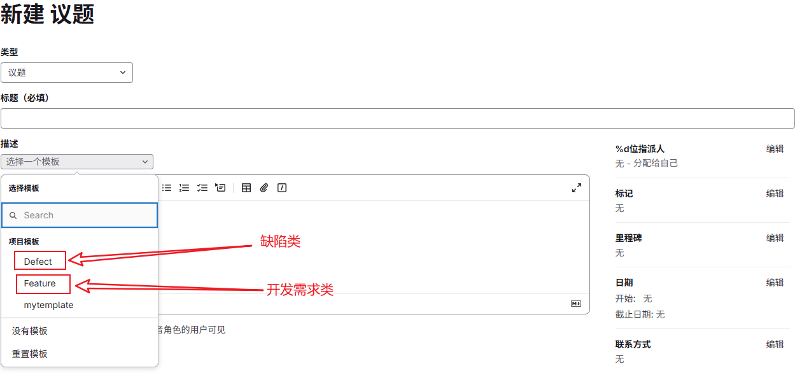
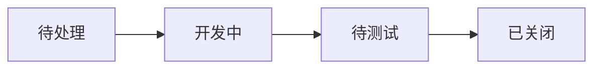
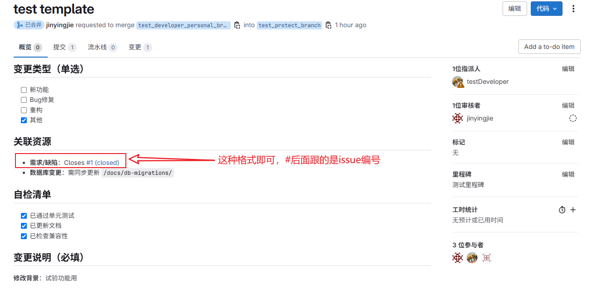
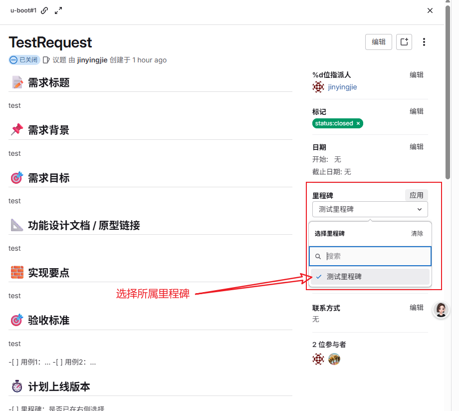
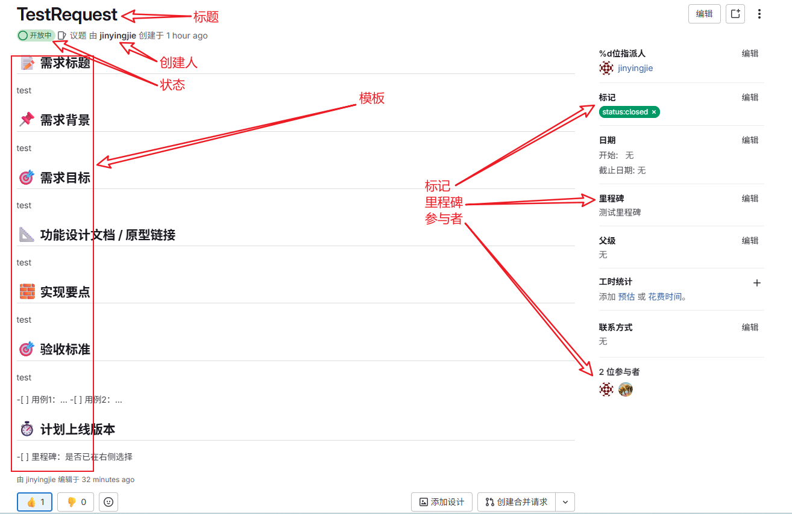
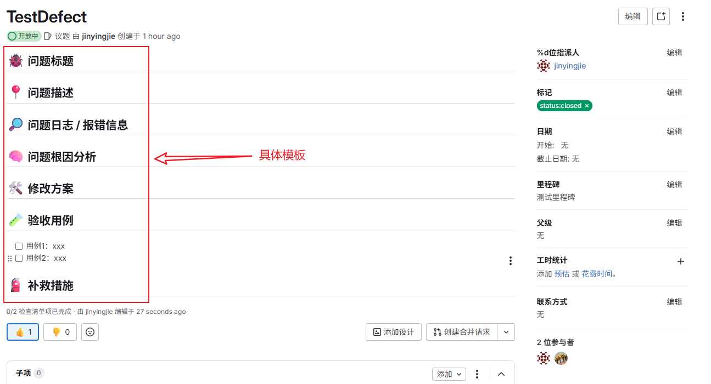

# 议题管理规范（Issue 规范）

本章介绍如何在 GitLab 中规范地使用议题（Issue）进行任务、需求和缺陷的管理，确保团队协作流程统一、高效。

---

## 1 议题概述

GitLab 的议题（Issue）用于记录与项目相关的工作事项，例如功能需求、BUG修复、技术任务等。每个 Issue 可以指派负责人、设置优先级、标签、里程碑，并与代码变更（MR）关联，形成闭环。

---

## 2 议题类型与命名规范

议题应按类型划分，命名应清晰明确，便于识别：

| 类型     | 前缀示例     | 命名示例                          |
|----------|--------------|-----------------------------------|
| 需求类   | `[Feature]`       | `[Feature] 用户注册页面改版`          |
| 缺陷类   | `[Defect]`      | `[Defect] 登录接口报500错误`        |


---

## 3 议题模板使用说明

在创建议题时，需选择对应模板进行填写：

- **[Feature] 需求模板**：包括背景、目标、设计文档等
- **[Defect] 缺陷模板**：包括问题描述、日志信息、根因分析、修复方案等



## 4 状态流转与处理流程

议题的处理应遵循以下状态流转流程：


建议使用标签标识状态变化，例如：
- `status:pending`
- `status:in-dev`
- `status:ready-for-test`
- `status:closed`
开发者或负责人应在每个阶段及时更新状态。
---

## 5 与合并请求（MR）的关联方式

在 MR 描述中添加如下语句可实现自动关闭 Issue：

Closes #123<br>
Fixes #456<br>
Resolves #789<br>

## 6 标签与里程碑使用规范
议题应设置以下元素以便分类与追踪：

标签（Label）：指定类型、状态、模块、优先级等。*`这里只展示此功能，具体方案需后续统一讨论一起定夺`*

例如：status:in-dev

里程碑（Milestone）：绑定需求或缺陷所属的里程碑


## 4.7 示例议题
*`这里只展示此功能，具体方案需后续统一讨论一起定夺`*
### 示例1：[SR] 用户资料页改版
```
需求标题：当前资料页功能简陋，用户反馈较多<br>
需求目标：重构前端交互，统一API<br>
功能文档：外部链接<br>
实现要点
验收标准
计划完成时间
```

### 示例2：[DTS] 用户登录失败返回500
```
问题描述：尝试登录时报错，控制台返回500
日志信息：Cannot read property 'token' of undefined
根因：后端未处理 null 场景
修复方案：增加参数校验
标签：bug, P0, backend, status:in-dev
关联 MR：!123
```
