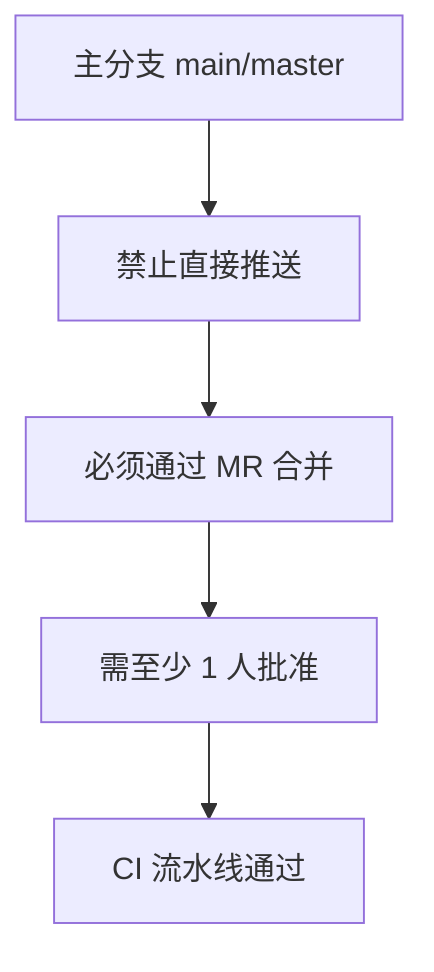
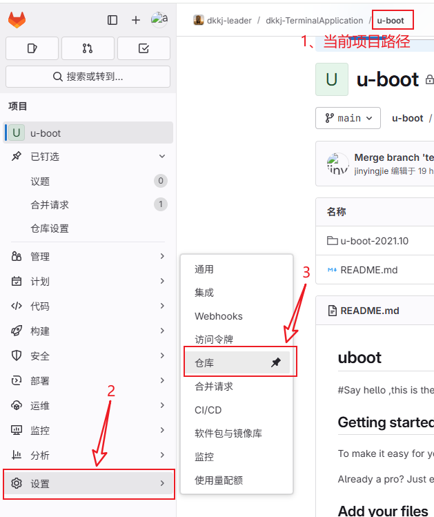
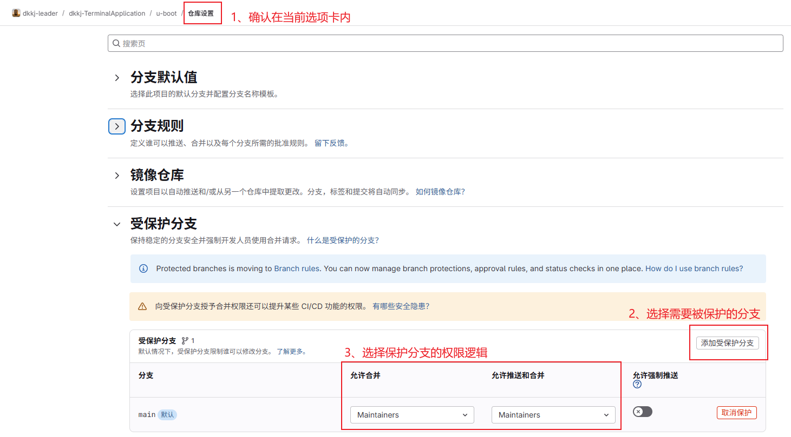
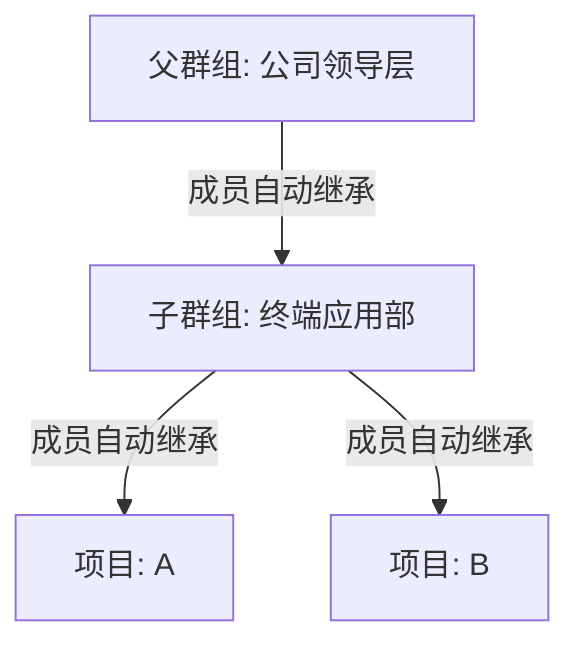
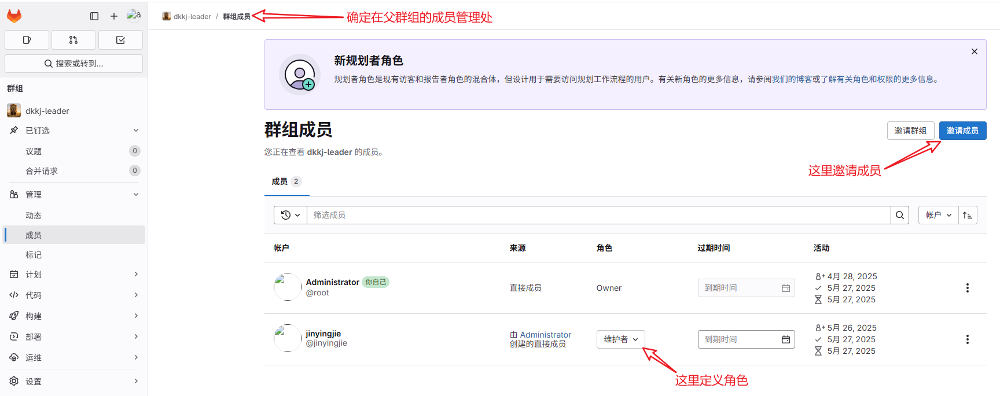
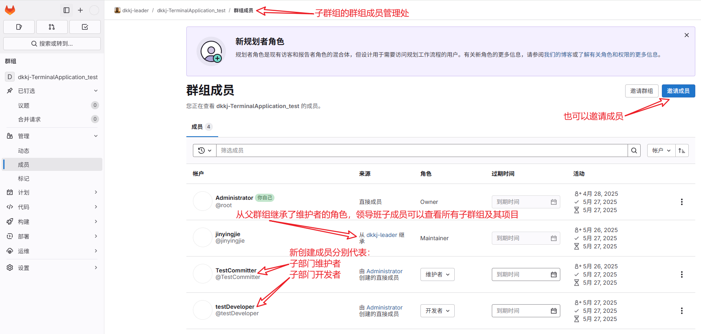
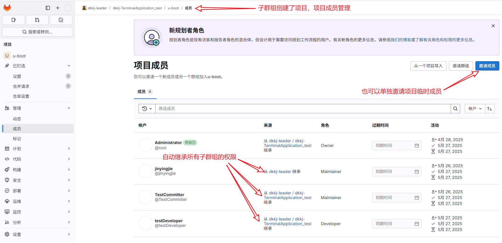

# GitLab 权限控制篇
## 1. GitLab 角色与权限对照表
核心角色权限对比
| 权限                 | Guest | Reporter | Developer | Maintainer | Owner/Admin |
| -------------------- | ----- | -------- | --------- | ---------- | ----------- |
| 查看项目             | ✅     | ✅        | ✅         | ✅          | ✅           |
| 创建 Issue           | ❌     | ✅        | ✅         | ✅          | ✅           |
| 提交代码到非保护分支 | ❌     | ❌        | ✅         | ✅          | ✅           |
| 推送保护分支         | ❌     | ❌        | ❌         | ✅          | ✅           |
| 合并MR               | ❌     | ❌        | ❌         | ✅          | ✅           |
| 修改项目设置         | ❌     | ❌        | ❌         | ✅          | ✅           |
| 删除项目             | ❌     | ❌        | ❌         | ❌          | ✅           |

## 2. 保护分支（Protected Branches）配置
关键分支保护规则

操作步骤 
1、进入项目设置：
项目 → 设置 → 仓库 → 展开“保护分支”

2、配置保护规则：
- **分支名称**: `main` 或 `production`
- **发起合并请求**:`开发者可以发起合并请求，一般称之为MR（Merge Request）`
- **允许合并**: `维护者+` (允许开发者发起 MR，但需维护者批准)
- **允许推送并合并**: `维护者`
- **允许强制推送**: `❌ 禁用` (防止历史被篡改)

3、通配符保护（需要批量设置前缀一致的分支的情况，和上面类似）:
- **分支模式**: `release/*`
- **发起合并请求**:`开发者`
- **允许合并**: `维护者`
- **允许推送并合并**: `维护者`

## 3. 组级别权限继承

权限继承流程图

批量管理步骤 
1、创建群组： 
- 导航 → 群组 → 新建群组（如 backend-team） 

2、分配组权限： 
- **权限级别**: `Developer` (默认成员权限)
- **特殊成员**: 手动提升 TL 为 `Maintainer`

3、项目继承权限：

新建项目时选择所属群组，自动继承组权限

4、以成员管理为例具体演示： 
父群组： 

子群组： 

子群组项目： 
